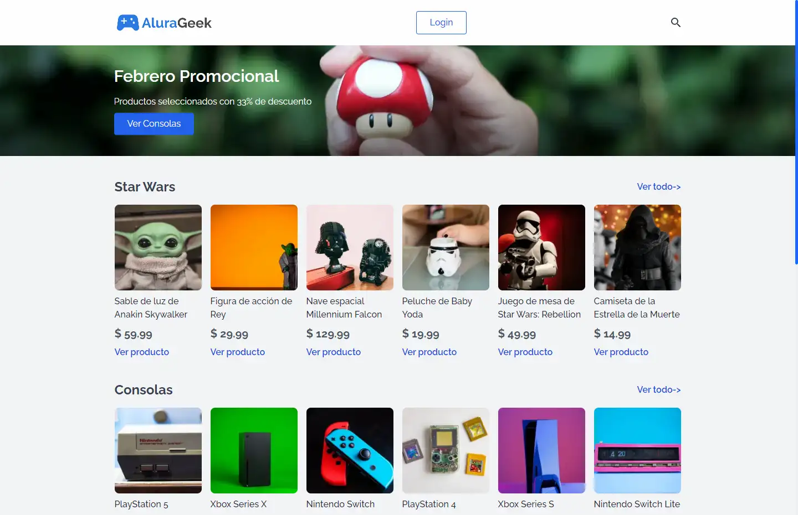

# E-commerce - Challenge ONE Front-end Sprint 02

El objetivo de este desafío es completar la creación de una tienda en línea. Actualmente, solo se ha desarrollado la parte visual, ya que fue concebida como una oportunidad para aprender acerca de la API View Transition. El propósito final es alcanzar una tienda completamente funcional que permita a los usuarios realizar compras de manera efectiva y proporcionar una experiencia de usuario óptima.
## Table of contents

- [E-commerce - Challenge ONE Front-end Sprint 02](#e-commerce---challenge-one-front-end-sprint-02)
  - [Table of contents](#table-of-contents)
  - [Resumen](#resumen)
    - [Requisitos del desafío](#requisitos-del-desafío)
    - [Enlaces](#enlaces)
    - [Construido con:](#construido-con)
  - [Author](#author)

## Resumen

### Requisitos del desafío

- Una página de inicio que contiene un botón de inicio de sesión y un motor de búsqueda de productos ofrecidos por la empresa.
- Un banner que contenga descuentos, promociones o informaciónes relevante del momento.
- Una galería con información del producto, como imagen, nombre del producto, precio y un enlace a la página de descripción del producto.
- Una página de producto que contiene la imagen, el nombre, la descripción y el precio.
- Un pie de página con un formulario de contacto y otras informaciónes relevantes.
- Un formulário de iniciar sesión para autenticar a los usuarios que quieran acceder al menu administrador.
- Menú de administrador para que puedan agregar, editar, buscar o eliminar productos de la tienda.

### Enlaces

- Solución URL: [Alura-geek](https://alura-geek-viewtransition.netlify.app/)
- Sítio en línea URL: [SVAM Potafolio](https://svam-alura.netlify.app/)

### Construido con:

- Semantic HTML5 markup
- CSS custom properties
- Flexbox
- JavaScript
- [Astro](https://astro.build/)
- [Tailwind](https://tailwindcss.com/)
- [View Transition](https://developer.mozilla.org/en-US/docs/Web/API/View_Transitions_API)

## Author

- GitHub - [StalinAM](https://github.com/StalinAM)
- ONE – Oracle Next Education - [Oracle](https://www.oracle.com/lad/education/oracle-next-education/)
- Alura LATAM - [Alura](https://www.aluracursos.com/)